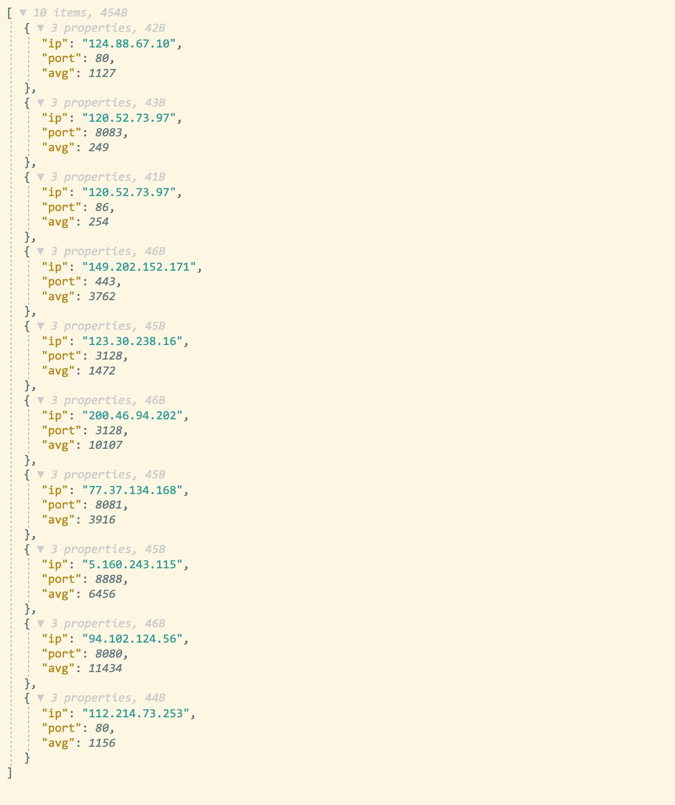
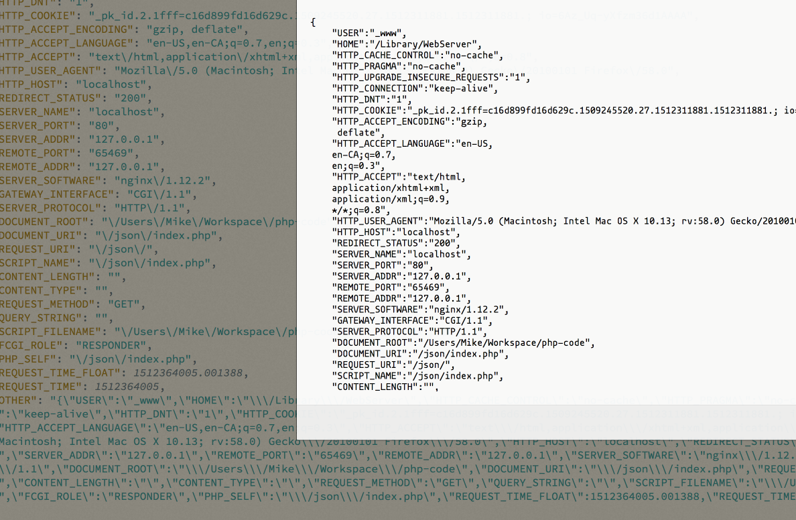

MJsonViewer
---

Yet, just another jsonview plugin for Firefox.

## Why I write this plugin.
1. I love Firefox.
2. I find its default jsonviewer is ugly and not directly.

## How it looks like.
### Its common look.
> 
### If a value-string is a json, when you click the parser will show its structure.
> 

## How to install.
+ Use Firefox to open this [URL:https://addons.mozilla.org/en-US/firefox/addon/mjsonviewer](https://addons.mozilla.org/en-US/firefox/addon/mjsonviewer/)
+ or just search in the firefox addon store with keyword: 'MJsonViewer'.

## How to Config
+ Open your `about:addons` page and find the **MJsonViewer** line.
+ Click the Preference and edit by yourself.

## TODO
See [TODO.md](./TODO.md)

## LICENSE
See [LICENSE](./LICENSE)

## Thanks
Inspired by [json-lite](https://github.com/lauriro/json-lite)
